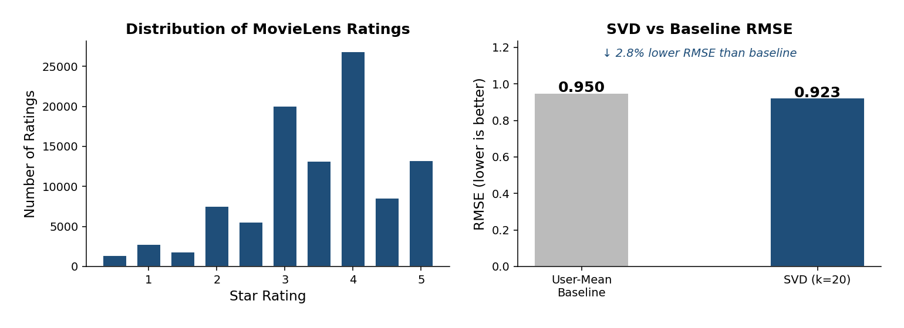

# Movie Recommendation System — Collaborative Filtering (SVD)

A recommendation engine that predicts which movies a user will enjoy based on the rating patterns of similar users — the same core algorithm behind Amazon's "Customers also bought" and Netflix's suggestions.

## Results

Trained on the **MovieLens dataset** (real user ratings collected by the GroupLens research lab).

| Metric | Score |
|---|---|
| SVD RMSE | 0.923 |
| Baseline RMSE | 0.950 |
| Improvement | 2.8% lower error than baseline |




## How It Works

Collaborative filtering answers: *"Users who rated movies similarly to you also liked X — so you probably will too."*

```
User-Movie Ratings Matrix (sparse)
          ↓
  Subtract each user's mean rating
          ↓
  SVD:  R ≈ U × Σ × Vᵀ
  (U = user taste, V = movie characteristics)
          ↓
  Reconstruct R to fill in missing ratings
          ↓
  Recommend unseen movies with highest predicted rating
```

## Dataset

Uses the **MovieLens ml-latest-small** dataset — 100,000 real ratings from ~600 users on ~9,000 movies.

Download from [grouplens.org/datasets/movielens](https://grouplens.org/datasets/movielens/), then place `ratings.csv` and `movies.csv` in the project folder.

The loader automatically handles real-world data quirks: non-contiguous movie IDs, half-star ratings (0.5–5.0), and high sparsity.

## How to Run

```bash
pip install -r requirements.txt
python recommendation_system.py
```

## Project Structure

```
movie-recommendation-svd/
├── recommendation_system.py
├── requirements.txt
├── README.md
├── ratings.csv          # from MovieLens
├── movies.csv           # from MovieLens
└── results/
    └── recommendation_charts.png
```

## Key Concepts

- **Collaborative Filtering** — recommends based purely on rating patterns, without needing to know what a movie is about
- **SVD (Singular Value Decomposition)** — factorizes the ratings matrix into latent user and movie vectors; the k factors capture hidden "taste dimensions" like action-fan or rom-com-fan
- **Sparsity** — real platforms have over 98% missing ratings, so the model must generalize from a tiny fraction of observed data
- **RMSE** — Root Mean Squared Error on held-out ratings, measuring how close predicted stars are to actual stars

## Extensions

- Add item-based collaborative filtering (movie-movie similarity) and compare
- Implement user-user cosine similarity as an alternative
- Tune the number of latent factors (k) and plot RMSE vs k
- Deploy as a Streamlit web app with a user dropdown and live recommendations
